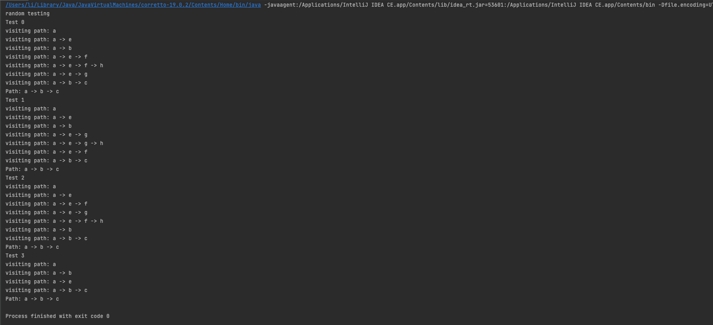

### 0 Basic Info

GitHub repo link:[TopKingHao/cse464p2 (github.com)](https://github.com/TopKingHao/cse464p2)

### 1 Refactoring

1. I reorganize the whole project, which used to have two projects in my folder and 
   make other people confused about it. So I move the source code out of the untitled 
   folder and remove the untitled folder. I also move test folder out of src folder, 
   to make people easy to get the unit tests.
   
    link: https://github.com/TopKingHao/cse464p2/commit/d12e177c5befee040811cc009803b15164e09017
2. Rename the unregulated function name GraphSearch and GraphSearchBFS to 
   graphSearchBFS and graphSearchDFS, to make all the function name fit Camel-Case. 
   Also, add BFS suffix to the GraphSearch function before to make it more clear.

    link:https://github.com/TopKingHao/cse464p2/commit/c8be3fbca0dc6571adfcd475e8c513e82ab058e7
3. Extract common code part from graphSearchBFS and graphSearchDFS. Previously, there
   is a common part of code in graphSearchBFS and graphSearchDFS, which will get the 
   path from the src to dst. I extract it out of the two functions and create a new 
   function called getPath to do it.

    link:https://github.com/TopKingHao/cse464p2/commit/715ecc6bb145a0b3bc0d6fb763efe1e36f9f0282
4. Extract common code part from graphSearchBFS and graphSearchDFS. Previously, there
   is a common part of code in graphSearchBFS and graphSearchDFS, which will judge if 
   the graph contains the src and dst. I extract it out of the two functions and create 
   a new function called judgeSearchProblem to do it.

    link:https://github.com/TopKingHao/cse464p2/commit/4a024b8020420c87d804060d3975cc7ec6b23d87
5. Remove unnecessary statement and modify the confusing code below:
   1. Unnecessary import statement.
   2. Unnecessary "override" statement.
   3. Empty string used in concatenation.
   4. Replace System.out.println(e) to e.printStackTrace() to get more info when 
   catch exception.
   
   link:https://github.com/TopKingHao/cse464p2/commit/35efcaa14885db00761cbeca11ea734f154724cb

### 2 Template pattern
Generally, both BFS and DFS can be done in 5 steps:
1. Check the start and the destination.
2. Put the start node into a data structure, ie. queue for BFS and stack for DFS.
3. Get the first node of the data structure.
4. Check all the node adjective to the node and put them into the data structure.
5. Go back to step 3.
What's difference between BFS and DFS is the data structure. So I can abstract a 
class called GraphSearch, which contains the basic flow. And override some functions 
which contain the operations about the data structure to implement two different algorithms.

When we need to solve the problem by DFS, we can construct the class named GraphSearchDFS
, and then the problem can be solved by DFS. Instead, when we need to solve the problem
by BFS, we can construct the class called GraphSearchBFS.

   link:https://github.com/TopKingHao/cse464p2/commit/3569dd833fde62906e121008b0a618da9487ae3e

### 3 Strategy pattern
To apply the strategy pattern based on the template pattern before, I need to firstly
extract the code in GraphSearch class to a new class named SearchStrategy, and the 
GraphSearch class only need to contain the function of reading the graph and choosing 
different strategy. To keep compatible with the template pattern refactoring 
commit, I created a new class named GraphSearchStrategy, which will be used 
instead when solve the problem in "strategy" way. The GraphSearchStrategy class
will init the searchStrategy when constructed, and when the graphSearch function is called, the graph and the src and dst will be passed
to the searchStrategy to solve the problem.

For SearchStrategy class, it can reuse the code in the GraphSearch class before. So 
different SearchStrategy class only need to override some operations to implement.

When we need to solve the problem by DFS, we can construct the GraphSearch class and 
pass a strategy class named SearchStrategyDFS. Instead, when we need to solve the 
problem by BFS, we can construct the GraphSearch class and pass a strategy class 
named SearchStrategyBFS. Demo can be seen below:
```java
GraphSearchStrategy graphSearchSolution = new GraphSearchStrategy(new SearchStrategyDFS());
GraphSearchStrategy graphSearchSolution = new GraphSearchStrategy(new SearchStrategyBFS());
```

link:https://github.com/TopKingHao/cse464p2/commit/65408098d3798bb9401de553dae820fe37e505d8

### 4 Instructions

You can run the code using the following program or run it directly in the GraphSearchTest.java file,
which contains the unite test of the code.

1. Template pattern BFS
   ```java
   public class Main {
      public static void main(String[] args) {
         MyGraph myGraph = new MyGraph();
         myGraph.parseGraph("input2.dot");
         GraphSearchBFS graphSearchSolution = new GraphSearchBFS(myGraph);
         MyGraph.Path path = graphSearchSolution.graphSearch("a", "g");
         System.out.println(path.toString());
      }
   }
   ```
   The output screenshot is below:
   

2. Template pattern DFS
   ```java
   public class Main {
      public static void main(String[] args) {
      MyGraph myGraph = new MyGraph();
      myGraph.parseGraph("input2.dot");
      GraphSearchDFS graphSearchSolution = new GraphSearchDFS(myGraph);
      MyGraph.Path path = graphSearchSolution.graphSearch("a", "g");
      System.out.println(path.toString());
      }
   }
   ```
   The output screenshot is below:
   

3. Strategy pattern BFS
   ```java
   public class Main {
      public static void main(String[] args) {
      MyGraph myGraph = new MyGraph();
      myGraph.parseGraph("input2.dot");
      GraphSearchStrategy graphSearchSolution = new GraphSearchStrategy(new SearchStrategyBFS());
      MyGraph.Path path = graphSearchSolution.graphSearch(myGraph, "a", "g");
      System.out.println(path.toString());
      }
   }
   ```
   Teh output screenshot is below
   
4. Strategy pattern DFS
   ```java
   public class Main {
       public static void main(String[] args) {
           MyGraph myGraph = new MyGraph();
           myGraph.parseGraph("input2.dot");
           GraphSearchStrategy graphSearchSolution = new GraphSearchStrategy(new SearchStrategyDFS());
           MyGraph.Path path = graphSearchSolution.graphSearch(myGraph, "a", "g");
           System.out.println(path.toString());
       }
   }
   ```
   The output screenshot is below:
   
5. Template pattern random
   ```java
      public class Main {
         public static void main(String[] args) {
         System.out.println("random testing");
         MyGraph myGraph = new MyGraph();
         myGraph.parseGraph("input2.dot");
         GraphSearchRandom graphSearchSolution = new GraphSearchRandom(myGraph);
            for(int i = 0; i < 4; i++) {
               System.out.println("Test "+ i);
               MyGraph.Path path = graphSearchSolution.graphSearch("a", "c");
               System.out.println("Path: " + path.toString());
            }
         }
      }
   ```
   The output screenshot is below:
   
6. Strategy pattern random
   ```java
   public class Main {
       public static void main(String[] args) {
           System.out.println("random testing");
           MyGraph myGraph = new MyGraph();
           myGraph.parseGraph("input2.dot");
           GraphSearchStrategy graphSearchSolution = new GraphSearchStrategy(new SearchStrategyRandom());
           for (int i = 0; i < 4; i++) {
               System.out.println("Test " + i);
               MyGraph.Path path = graphSearchSolution.graphSearch(myGraph, "a", "c");
               System.out.println("Path: " + path.toString());
           }
       }
   }
   ```
   The output screenshot is below:
   